# Executive Summary & Technical Architecture Report
## Alpaca Regime-Aware AI Options & Equity Trading System

---

## 1. Project Overview & Hackathon Alignment
This project is an institutional-grade autonomous AI algorithmic trading agent built for the **Alpaca AI Trading Agents Hackathon on LabLab.ai**.

The system addresses the hackathon's core technology requirements:
- **Alpaca Trading API**: For real-time and historical market data, equities, options chains, and order execution.
- **Alpaca MCP (Model Context Protocol) Server**: Exposing quantitative trading tools for agentic workflows and multi-agent interaction.
- **Alpaca CLI & Interactive Dashboard**: Providing programmatic command-line control and an auditable web interface.
- **Production-Style Quantitative Architecture**: Moving beyond simple demos to implement multi-regime technical classification, Gemini quantitative reasoning, a 100% deterministic mathematical risk gate, and an automated position lifecycle monitor.

---

## 2. Strict Guardrails & Core Rules (`PROJECT_RULES.md`)
1. **AI Output Isolation**: The LLM never places broker orders directly. It only outputs structured JSON proposals validated by Pydantic (`TradeIntent`).
2. **Deterministic Hard Risk Gate**: 100% deterministic Python rules evaluating position size (max 5.0% total account equity), buying power, stop-loss sanity, and defined-risk options protection.
3. **Regime-Aware Strategy Mapping**: Dynamic allocation to Bull Call Spreads, Bear Put Spreads, Iron Condors, or Range Trades based on detected market regimes.

---

## 3. End-to-End System Flow

```mermaid
flowchart TD
    subgraph S["Autonomous Execution (CLI, MCP Server, Streamlit UI)"]
        A1[1. Position Monitor & Exit Engine] --> A2{Check Open Positions}
        A2 -- Take Profit +50% / Stop Loss -40% --> A3[Liquidate Position]
        A2 -- Healthy PnL --> A4[Hold Position]
        A3 --> B1[Calculate Available Portfolio Capacity]
        A4 --> B1
        B1 --> B2[Scan Watchlist: SPY, AAPL, NVDA, QQQ, MSFT]
        B2 -->|Candidate Symbol| C1(data/market_fetcher.py)
        C1 -->|Daily OHLCV Bars| C2(analysis/regime_detector.py)
        C2 -->|SMA, RSI, ATR, Volatility| C3(agent/strategy_agent.py)
        C3 -->|Gemini Model Synthesis| C4[TradeIntent JSON]
        C4 --> C5{risk/risk_gate.py}
        C5 -- Rejected --> C6[Log Rejection & Discard]
        C5 -- Approved --> C7(execution/alpaca_executor.py)
        C7 -->|OCC Symbol & Order| C8[Alpaca Trading API]
    end
```



---

## 4. Module Breakdown

### A. `schemas/trade_intent.py`
Pydantic v2 schemas defining `TradeIntent`, `OptionLeg`, `MarketRegime`, and `InstrumentType` with strict validation blocking naked short options.

### B. `risk/risk_gate.py`
Mathematical risk barrier enforcing:
- Maximum 5.0% allocation of total equity per position.
- Buying power & cash validation.
- Stop-loss and profit target sanity relative to entry price and order side.

### C. `data/market_fetcher.py`
Historical bar and options chain client leveraging `StockHistoricalDataClient` and `OptionHistoricalDataClient` from `alpaca-py`.

### D. `analysis/regime_detector.py`
Deterministic technical analysis engine calculating SMA 20/50, RSI 14, ATR 14, Realized Volatility %, and Bollinger Bandwidth % across 5 market regimes.

### E. `agent/strategy_agent.py`
Google Gemini quantitative prompt engine with structured JSON output, automatic date context injection, and model failover support.

### F. `execution/alpaca_executor.py` & `execution/position_monitor.py`
OCC Option Symbol formatter (`TICKER + YYMMDD + C/P + STRIKE`), order submission engine, and active position lifecycle monitor with +50% Take Profit / -40% Stop Loss automation.

### G. `scheduler/autonomous_runner.py`
Continuous orchestrator scanning watchlists, checking portfolio slots, and executing full cycles.

### H. `mcp_server/server.py`
Model Context Protocol tool server exposing 7 quantitative tools over standard JSON-RPC protocol.

### I. `cli.py`
Interactive command-line interface for running scans, checking regimes, generating strategies, and inspecting positions.

### J. `dashboard/app.py`
Streamlit execution dashboard featuring live KPI metrics, Market Regime Radar with Plotly charts, Explainable AI reasoning logs, and active position monitors.

---

## 5. Directory Structure

```text
ALPACA AI Trading/
├── .env.example
├── .gitignore
├── PROJECT_RULES.md
├── PROJECT_SUMMARY.md
├── README.md
├── requirements.txt
├── cli.py
│
├── schemas/
│   ├── __init__.py
│   └── trade_intent.py
│
├── risk/
│   ├── __init__.py
│   └── risk_gate.py
│
├── data/
│   ├── __init__.py
│   └── market_fetcher.py
│
├── analysis/
│   ├── __init__.py
│   └── regime_detector.py
│
├── agent/
│   ├── __init__.py
│   └── strategy_agent.py
│
├── execution/
│   ├── __init__.py
│   ├── alpaca_executor.py
│   └── position_monitor.py
│
├── scheduler/
│   ├── __init__.py
│   └── autonomous_runner.py
│
├── mcp_server/
│   ├── __init__.py
│   └── server.py
│
├── dashboard/
│   ├── __init__.py
│   └── app.py
│
├── test_modules.py
├── test_market_analysis.py
├── test_pipeline_e2e.py
└── test_runner.py
```

---

## 6. Automated Test Verification (100% PASS)

| Test Suite | Components Tested | Status |
| :--- | :--- | :---: |
| `test_modules.py` | Pydantic Schema Validation & Deterministic Risk Gate | **PASS** |
| `test_market_analysis.py` | Data Fetcher, Indicator Calculations, Regime Detection | **PASS** |
| `test_pipeline_e2e.py` | Multi-Symbol End-to-End Multi-Step Pipeline | **PASS** |
| `test_runner.py` | Position Monitor Auto-Exit & Autonomous Watchlist Runner | **PASS** |
